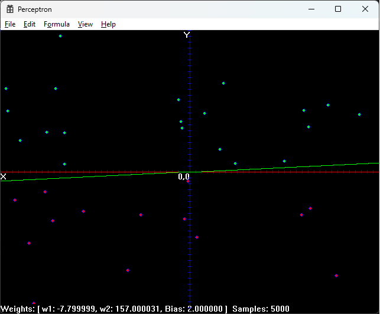
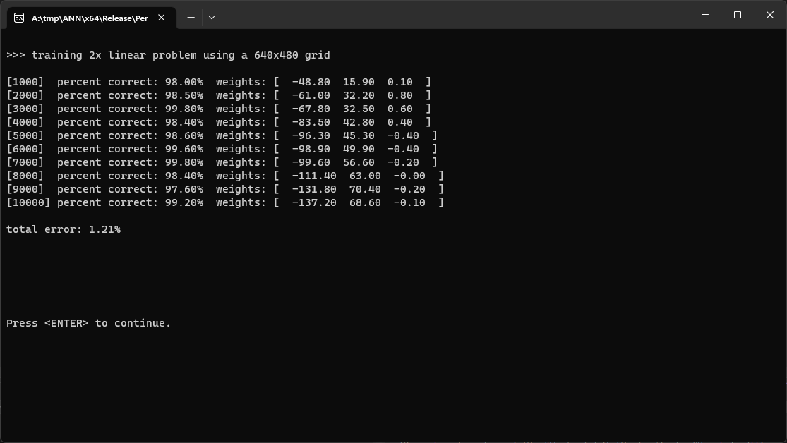

Artificial Neural Network (ANN)
===============================

Project Overview
----------------

Artificial Neural Network (ANN) is a software project designed to explore the capabilities of artificial neural networks in performing various tasks, ranging from simple perceptron logic gates to complex image recognition using the MNIST dataset.

Project Objectives
------------------

The primary objectives of the ANN project are to:

* Construct and understand the basic building block of ANNs: the perceptron.

* Implement perceptron logic gates: AND, OR, NOT, and NAND.

* Achieve accurate XOR operation using a single perceptron: Demonstrate the limitations of a single perceptron.

* Design and train a multilayer perceptron (MLP) network: Utilize multiple layers of perceptrons to overcome the limitations of a single-layer perceptron.

* Solve the MNIST dataset with MLP: Recognize handwritten digits from the MNIST dataset with results within the margin of error of those published on the official site.

MNIST Results:
--------------

Visualization of linear problems solved by a perceptron.
--------------------------------------------------------

Training a perceptron.
----------------------

